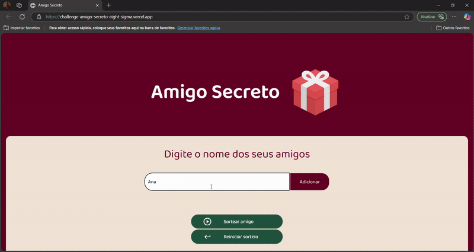

# 🎁 Amigo Secreto

Este projeto é um sorteador de **Amigo Secreto** feito com **HTML, CSS e JavaScript** para um Challenge da Alura. Ele permite que os usuários adicionem nomes à lista, realizem o sorteio e visualizem os resultados de forma dinâmica.

---

## 📌 Funcionalidades
- Adicionar nomes à lista 
- Impedir nomes duplicados ao padronizar primeira letra maiúscula  
- Sortear um amigo secreto aleatoriamente  
- Sortear se tiver dois ou mais amigos na lista  
- Exibir o nome sorteado  
- Desativar o botão de sorteio quando todos forem sorteados  
- Reiniciar o sorteio e limpar os dados  

---

## 🎥 Demonstração



---

## 🚀 Como executar o projeto

1. Baixe ou clone o repositório:
```bash
   git clone https://github.com/seu-usuario/amigo-secreto.git
```
2. Abra o arquivo `index.html` no navegador.

---

## 🛠️ Tecnologias utilizadas
- **HTML** → Estrutura da página
- **CSS** → Estilização
- **JavaScript** → Lógica do sorteio

---
Feito por Andressa 👩🏽
